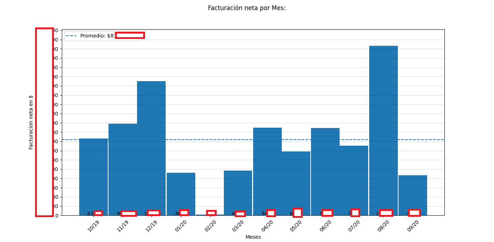
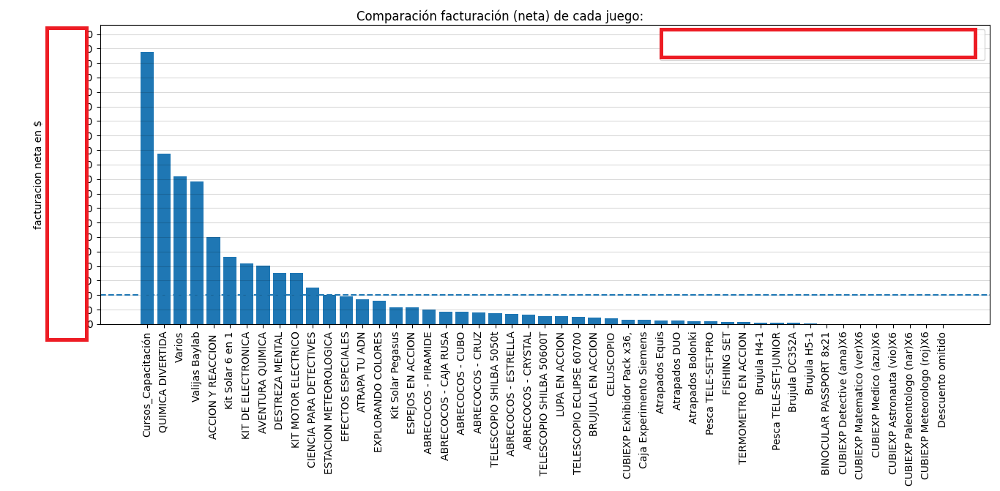

# CPT datos ventas

Versión cruda de análisis de datos de planilla de ventas de una empresa

## Cómo funciona:
La empresa tiene un sistema simple de facturación, en donde las ventas históricas se pueden exportar a una planilla de Excel. El programa tiene 3 scripts:
+ Dataset.py se limpia y ordena esta planilla y la guarda como un dataframe. Y también sea crean funciones útiles que luego se utilizarán, como graficar. Este script luego se importará en otros módulos.
+ Estadísticas generales.py importa el módulo Datasey.py y analiza y grafica la facturación y las ventas por mes y por año.
+ Estadísticas juegos.py importa el módulo Datasey.py y analiza y grafica las ventas específicas de cada juego.

